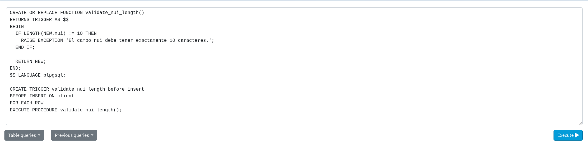

# FUNCIONES 
## INSTRUCCIONES:
### 1.- Crear un función y un trigger para validar que el numero de cedula del cliente tenga 10 números (no letras) en la tabla cliente.

  ```
CREATE OR REPLACE FUNCTION validate_nui_length()
RETURNS TRIGGER AS $$
BEGIN
  IF LENGTH(NEW.nui) != 10 THEN
    RAISE EXCEPTION 'El campo nui debe tener exactamente 10 caracteres.';
  END IF;

  RETURN NEW;
END;
$$ LANGUAGE plpgsql;

--trigger / disparadores
CREATE TRIGGER validate_nui_length_before_insert
BEFORE INSERT ON client
FOR EACH ROW
EXECUTE PROCEDURE validate_nui_length(); 
  ```
 - Captura: 

 

---
### 2.- Crear un función y un trigger para que cada vez que se inserte un nuevo registro en la tabla item se disminuya el stock de la tabla product.
```
CREATE OR REPLACE FUNCTION update_stock_on_detail_insert()
RETURNS TRIGGER AS $$
BEGIN
  UPDATE productos
  SET cantidad_en_stock= cantidad_en_stock - NEW.quantity
  WHERE id = NEW.product_id;

  RETURN NEW;
END;
$$ LANGUAGE plpgsql;

CREATE TRIGGER update_stock_after_detail_insert
AFTER INSERT ON detail
FOR EACH ROW
EXECUTE PROCEDURE update_stock_on_detail_insert();
  ```
 - Captura: 

 

 ### 3.- Crear un función y un trigger para la tabla invoice donde valide que el campo create_at sea del año actual (fecha sistema).

```
CREATE OR REPLACE FUNCTION validate_create_at_year() RETURNS TRIGGER AS $$
BEGIN
    IF EXTRACT(YEAR FROM NEW.create_at) != EXTRACT(YEAR FROM CURRENT_DATE) THEN
        RAISE EXCEPTION 'La fecha de creación debe ser del año actual: %', NEW.create_at;
    END IF;
    RETURN NEW;
END;
$$ LANGUAGE plpgsql;


CREATE TRIGGER validate_create_at_year_trigger
BEFORE INSERT OR UPDATE ON Invoice
FOR EACH ROW
EXECUTE FUNCTION validate_create_at_year();

  ```
 
 
  ### 4.- Crear un función y un trigger para la tabla client y validar que el correo tenga un @.

  ```
CREATE OR REPLACE FUNCTION validate_email() RETURNS TRIGGER AS $$
BEGIN
    IF POSITION('@' IN NEW.email) = 0 THEN
        RAISE EXCEPTION 'Correo inválido: %', NEW.email;
    END IF;
    RETURN NEW;
END;
$$ LANGUAGE plpgsql;

CREATE TRIGGER validate_email_trigger
BEFORE INSERT OR UPDATE ON Client
FOR EACH ROW
EXECUTE FUNCTION validate_email();

  ```
 
