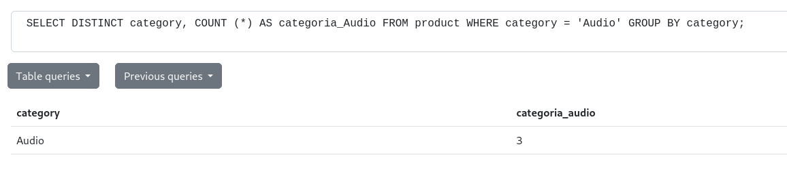
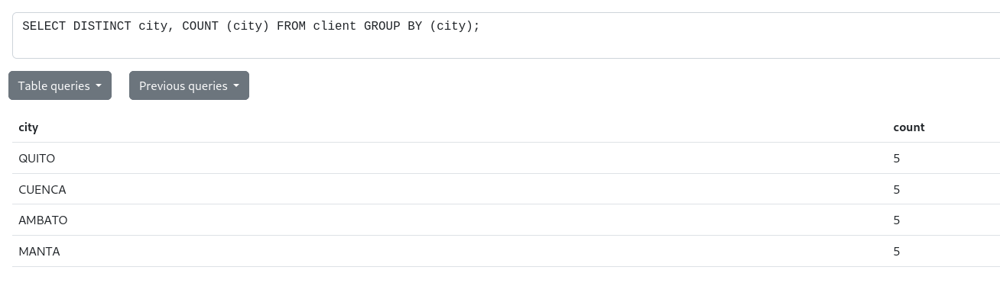
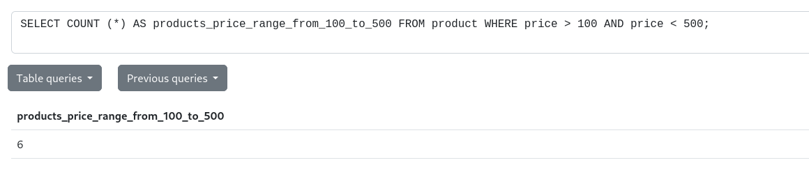
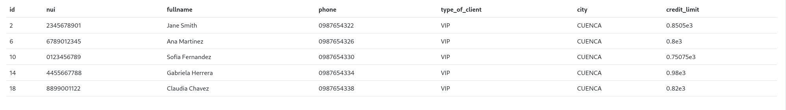
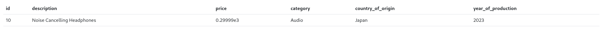
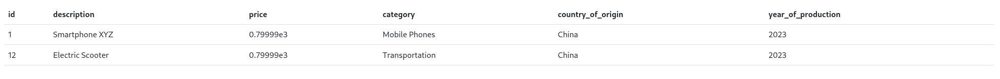
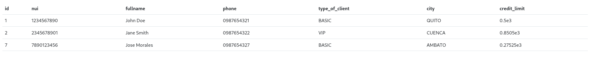
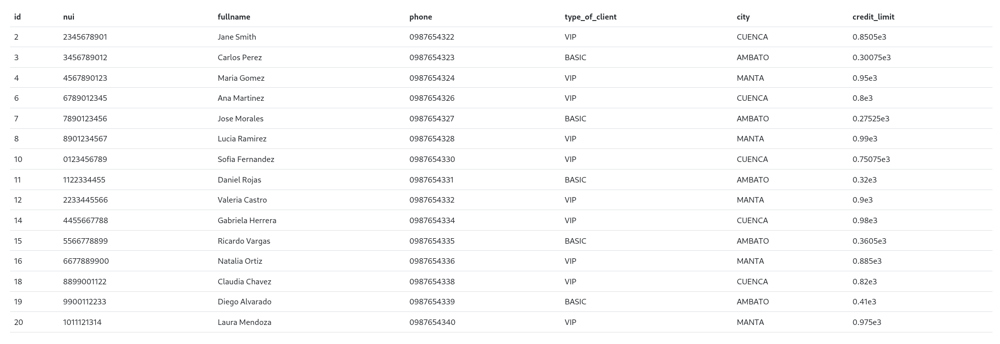

# FUNCIONES SEGREGACIÓN.
## INSTRUCCIONES:
### 1.- Obtener la edad promedio de los miembros:
    ```
    SELECT COUNT (*) AS categoria_Audio FROM product WHERE category = 'Audio'; 
    ```
 - Captura: 

 

---

### 2.- Contar el número de clientes en una ciudad específica.
- Sentencia: 
```
SELECT DISTINCT city, COUNT (city) FROM client GROUP BY (city);
```
- Captura:



---
### 3.- Contar el número de productos cuyo precio está dentro de un rango específico 
- Sentencia: 
```
SELECT COUNT (*) AS products_price_range_from_100_to_500 FROM product WHERE price > 100 AND price < 500;
```
- Captura:



---

### 4.- Seleccionar clientes que viven en una ciudad específica y tienen un tipo de cliente específico:
- Sentencia: 
```
SELECT * FROM client WHERE city = 'CUENCA' AND type_of_client = 'VIP';
```
- Captura:



---

### 5.- Seleccionar productos que pertenecen a una categoría específica y cuyo precio está por encima de un valor específico:
- Sentencia: 
```
SELECT * FROM product WHERE category = 'Audio' AND price >= 100;
```
- Captura:



---

### 6.- Seleccionar productos que fueron producidos en un año específico y en un país de origen específico:
- Sentencia: 
```
SELECT * FROM product WHERE year_of_production = '2023' AND country_of_origin = 'China';
```
- Captura:



---

### 7.- Seleccionar clientes cuyo nombre completo comience con 'J':
- Sentencia: 
```
SELECT * FROM client WHERE fullname LIKE 'J%';
```
- Captura:



---

### 8.- Seleccionar clientes cuya ciudad contenga la letra 'a':
- Sentencia: 
```
SELECT * FROM client WHERE city LIKE '%A%';
```
- Captura:



---


