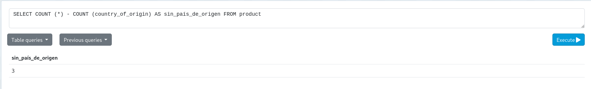
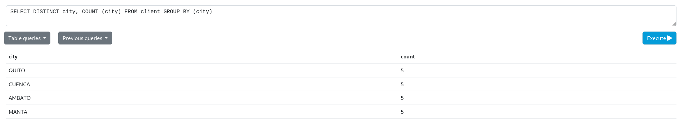

# TAREA EN CLASE SEMANA #8 : USOS DE COUNT 
## INSTRUCCIONES:
### 1.- Escribir una sentencia para contar los datos de productos donde no estén registrados los países de origen y la cuenta de los países deben estar en español:
- Sentencia: 
 ```
 SELECT COUNT (*) - COUNT (country_of_origin) AS sin_país_de_origen FROM product 
 ```
 - Captura: 

 

### 2.- Escribir la sentencia para contar los número de clientes existentes en cada país donde se muestre el país y la cuenta de número de clientes por cada país.
- Sentencia: 
```
SELECT DISTINCT city, COUNT (city) FROM client GROUP BY (city)
```
- Captura:


