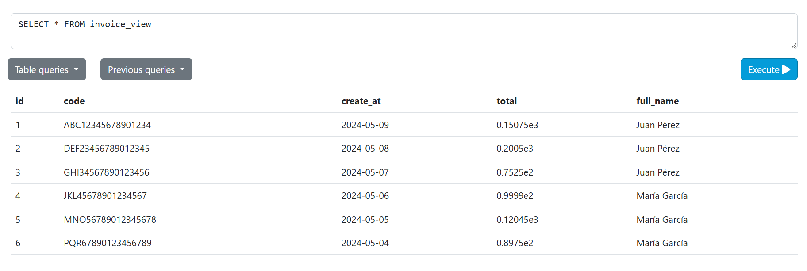
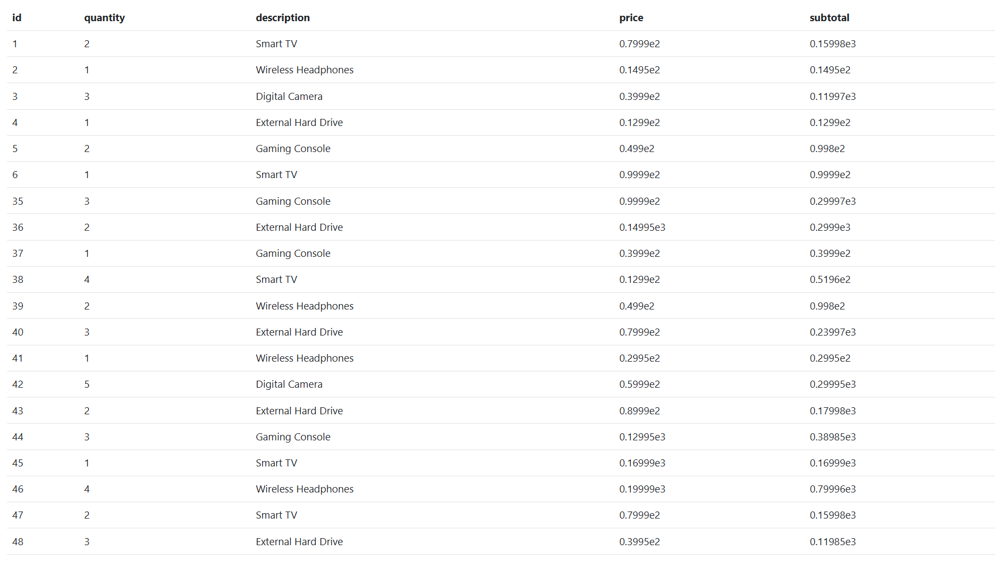

# View SQL
Creación de una vista.
Primero consideramos las columnas que necesitamos desde sus tablas predecesoras y las unimos con JOIN. Luego ejecutamos:

1.- Creación de invoice_view
```
CREATE VIEW invoice_view AS SELECT i.id, i.code, i.create_at, i.total, c.full_name FROM invoice i JOIN client c  ON c.id = i.client_id;
```
En resumen, se nos crea una vista del JOIN anterior.
Quedaría: 


2.- Creación de detailView
```
CREATE VIEW detail_view AS SELECT d.id, d.quantity, p.description ,d.price, d.quantity * d.price AS subtotal FROM product p JOIN detail d ON p.id = d.productid;
```
Esta vista quedaría:

